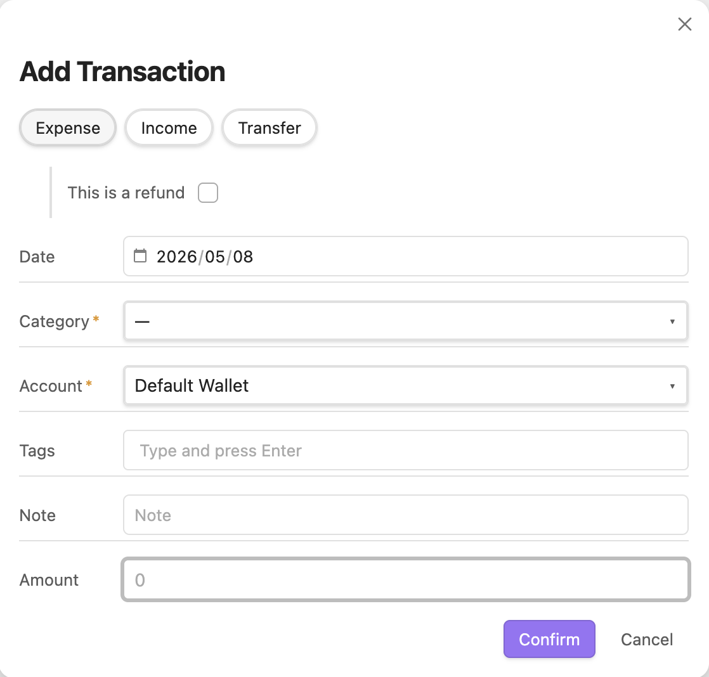
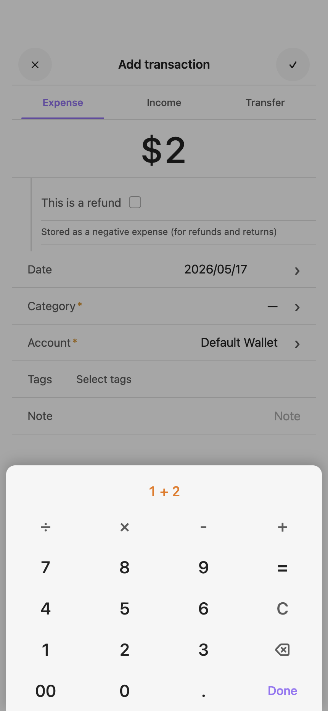
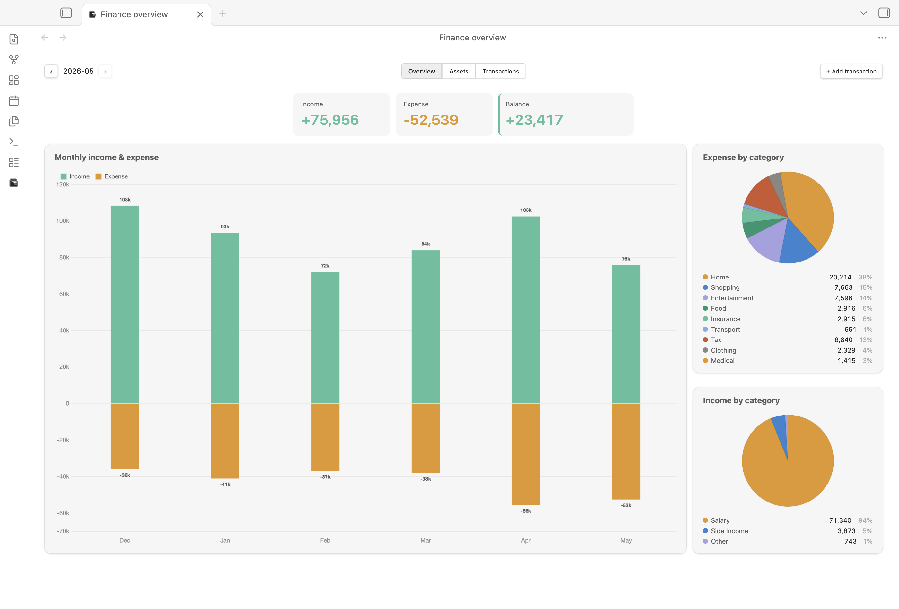
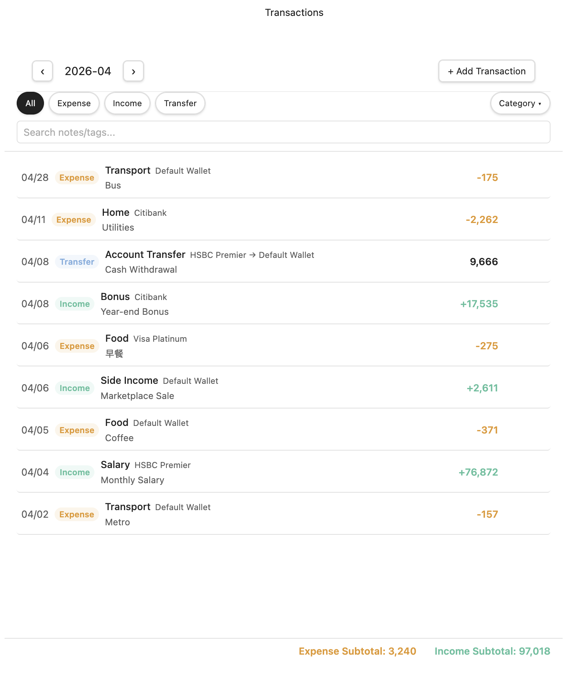
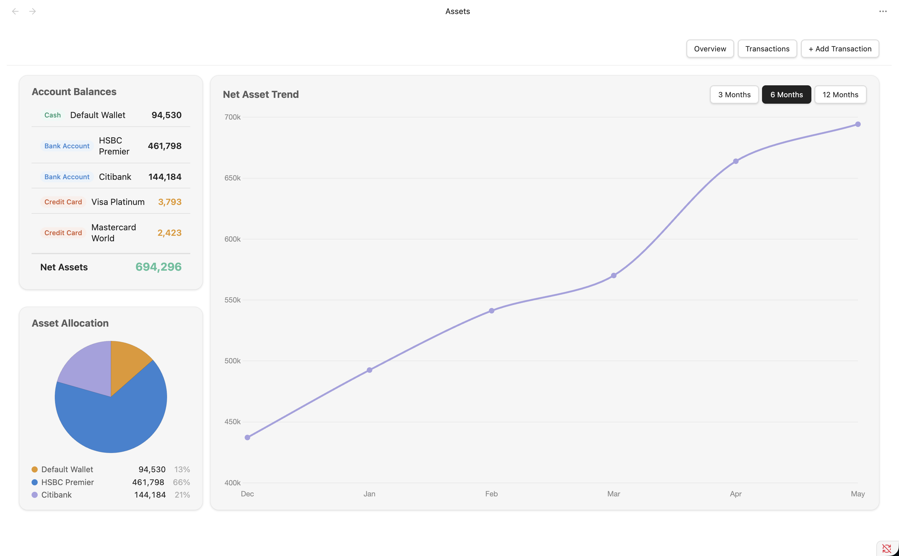
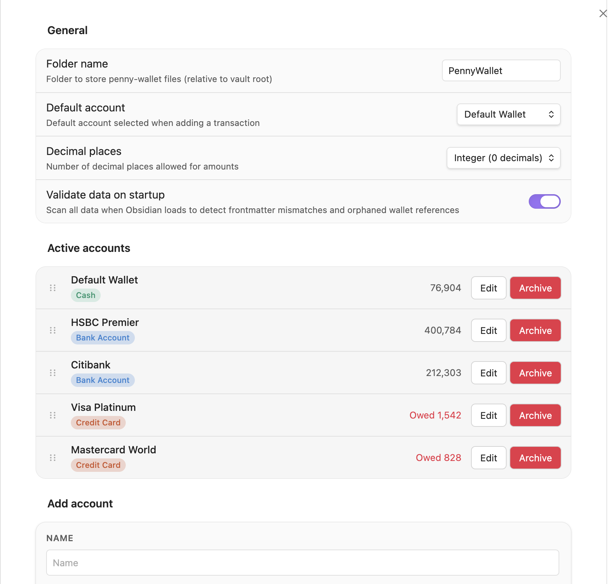

# PennyWallet

A personal finance tracker plugin for [Obsidian](https://obsidian.md). Log expenses, income, transfers, credit card payments, and refunds — all stored as plain Markdown tables in your vault.

**Documentation:** [English](https://twrusstw.github.io/penny-wallet/) · [繁體中文](https://twrusstw.github.io/penny-wallet/zh/)

## Features

- **Finance overview** — monthly income / expense summary, 6-month income/expense chart, and category pie charts
- **Transactions** — multi-select type and wallet filters, category and account dropdowns, date range, keyword search, and sticky subtotals
- **Assets** — 3 / 6 / 12-month range selector, account balances, net asset trend, savings rate, and asset allocation pie
- **Multiple account types** — cash, bank account, credit card (with debt tracking)
- **Custom categories** — add your own expense and income categories
- **Mobile-friendly entry** — touch-optimized transaction form with bottom-sheet pickers and an on-screen calculator
- **iOS Shortcuts support** — add transactions via URI without opening Obsidian
- **Bilingual** — English and Traditional Chinese (follows Obsidian language setting)

## Installation

### Community plugins

1. Open **Settings → Community plugins → Browse**
2. Search for **PennyWallet**
3. Click **Install**, then **Enable**

### BRAT (beta)

[BRAT](https://github.com/TfTHacker/obsidian42-brat) is a community plugin that installs beta plugins directly from GitHub and keeps them updated.

1. Install the **BRAT** plugin from **Settings → Community plugins → Browse** and enable it
2. Run **BRAT: Add a beta plugin for testing** from the Command Palette
3. Enter the repository: `twrusstw/penny-wallet`
4. Enable **PennyWallet** in **Settings → Community plugins**

### Manual

1. Download `main.js`, `manifest.json`, `styles.css` from the [latest release](https://github.com/twrusstw/penny-wallet/releases/latest)
2. Copy them to `<vault>/.obsidian/plugins/penny-wallet/`
3. Enable the plugin in **Settings → Community plugins**

## Getting started

1. Enable PennyWallet — a wallet icon appears in the left ribbon
2. Open **Settings → PennyWallet** and add your accounts with their current balances ([Settings guide](https://twrusstw.github.io/penny-wallet/settings) · [中文說明](https://twrusstw.github.io/penny-wallet/zh/settings))
3. Click the ribbon icon or run **Add transaction** from the Command Palette to log your first entry

## Transaction types

| Type | Description |
|------|-------------|
| **Expense** | Money out from cash / bank / credit card |
| **Income** | Money received into an account |
| **Transfer** | Move money between accounts, including credit card payments |

Credit card accounts track outstanding debt. Expenses increase the debt; credit card payment transfers reduce it. Refunds are stored as negative expenses and shown as positive expense reversals. Net asset calculation automatically subtracts credit card debt.

## Adding transactions

The transaction form supports refund entries, marks required fields, shows the original date when editing, and lets you attach tags as chips.



On mobile, wallet / category / tag fields open as bottom-sheet pickers, and the amount field opens a calculator sheet with `00`, ⌫, and a formula bar in the title — press **Done** to commit.



## Views

### Finance overview

Monthly summary with income, expense, and balance metrics, plus a 6-month income/expense chart and expense/income category pie charts. Each pie legend shows name, amount, and percentage.



### Transactions

Full transaction list with multi-select type and wallet filters (tinted pills), category and account dropdowns, date-range pickers, and keyword search. On mobile, the dropdowns and date range collapse into a **Filter ▾** sheet next to the search box. Edit via hover (desktop) or row tap (mobile); delete lives inside the edit modal. Header and subtotals stay fixed while the list scrolls.



### Assets

Medium-term financial view with a 3 / 6 / 12-month range selector, account balances, net asset trend, savings rate, and asset allocation pie.



### Settings

General preferences, account management (active / archived), and custom expense / income / transfer categories.



## URI handler

PennyWallet registers the `obsidian://penny-wallet` URI scheme, allowing external apps — including iOS Shortcuts — to open the transaction form with fields pre-filled.

```
obsidian://penny-wallet?type=expense&amount=280&category=food&note=Lunch
```

Supported parameters: `type`, `amount`, `note`, `category`, `wallet`, `fromWallet`, `toWallet`, `date`.

→ [Full URI handler & iOS Shortcuts guide](https://twrusstw.github.io/penny-wallet/uri-handler)

## Data format

Transactions are stored as Markdown tables, one file per month:

```
<vault>/
├── .penny-wallet.json     ← config (accounts, categories, settings)
└── PennyWallet/
    ├── 2026-04.md
    └── 2026-03.md
```

Each month file has YAML frontmatter (`income`, `expense`, `netAsset`) for fast loading, followed by a plain Markdown table of transactions:

```markdown
---
income: 75956
expense: 52539
netAsset: 0
---

## 2026-05

| Date | Type | Wallet | From | To | Category | Note | Tags | Amount | CreatedAt |
| ---- | ---- | ------ | ---- | -- | -------- | ---- | ---- | ------ | --------- |
| 05/02 | expense | HSBC Premier | - | - | housing | Rent | family,essential | 18418 | 2026-05-01T18:02:51.933Z |
| 05/02 | expense | Citibank | - | - | shopping | Online Shopping | - | 941 | 2026-05-01T20:08:15.639Z |
```

The format is compatible with Git sync and Dataview queries.

## License

[MIT](LICENSE)
